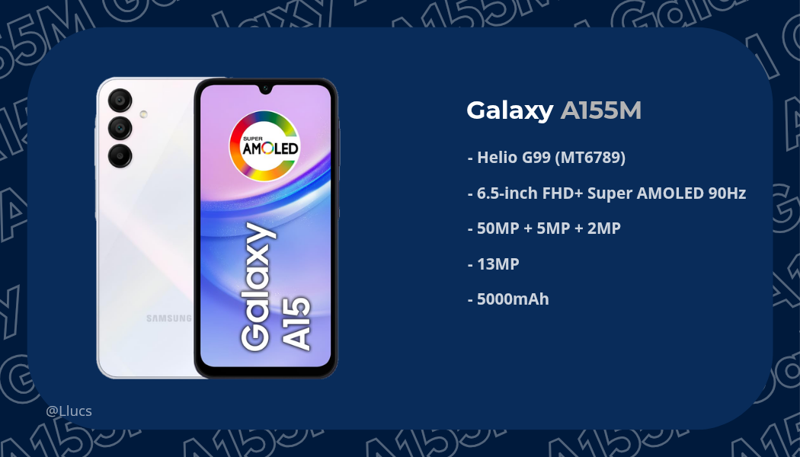
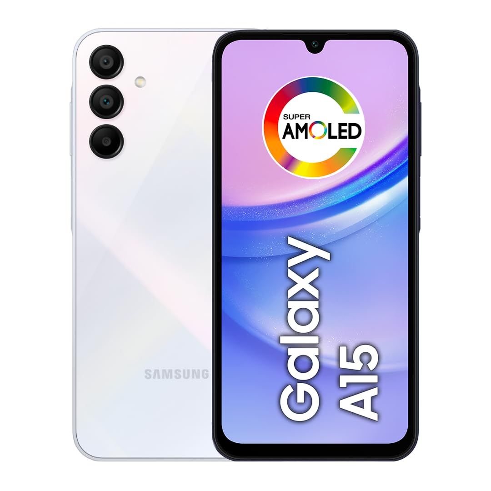

# Device Tree for Samsung Galaxy A15 4G (SM-A155M)

---

### Sources

- **Device Tree:** This repository
- **Vendor Blobs:** Extracted from stock firmware (One UI 7, Android 15)

---

### Notes

- Some hardware features may require custom vendor blobs and specific patches.
- Contributions, testing, and bug reports are highly appreciated!

---

### Device Image

---

*Since I'm the only one developing the device tree, it's expected that there will be several errors in the device tree, so if you want to contribute, please help me continue this project, It's very difficult to do all this alone at 13 years old, I have many things to do as well, so don't assume it's fully functional, wait until there are contributors who correct it.*

I'm doing this on my own with the help of several AIs, but they don't always get it right....

---

### Disclaimer
> [!CAUTION]
> I am **not responsible** for bricked devices, dead SD cards, thermonuclear war,  
or you getting fired because the alarm app failed.  
Please **do your own research** before flashing or modifying your device.  
YOU are choosing to make these modifications — if you blame me for messing up your device, I’ll laugh at you 😄